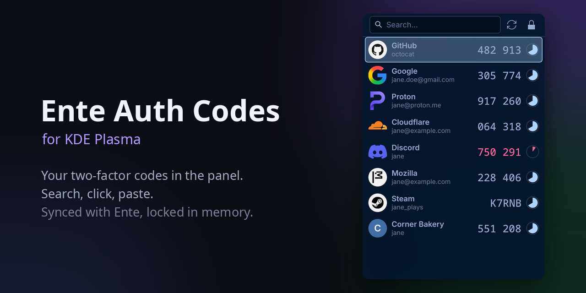
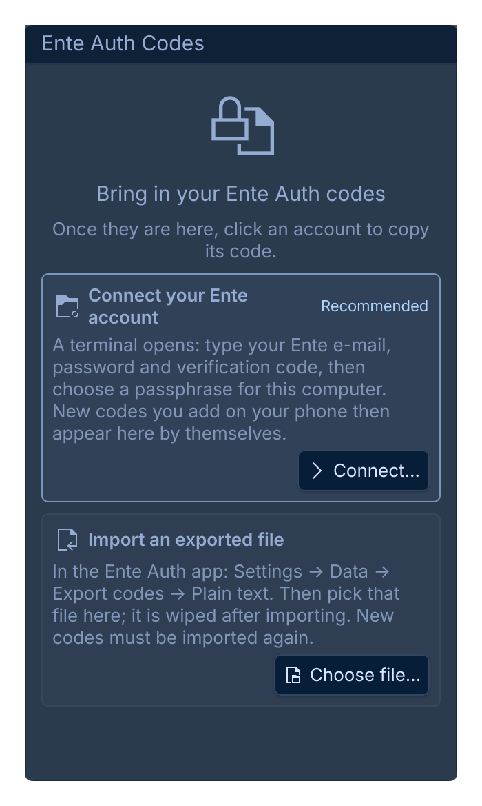
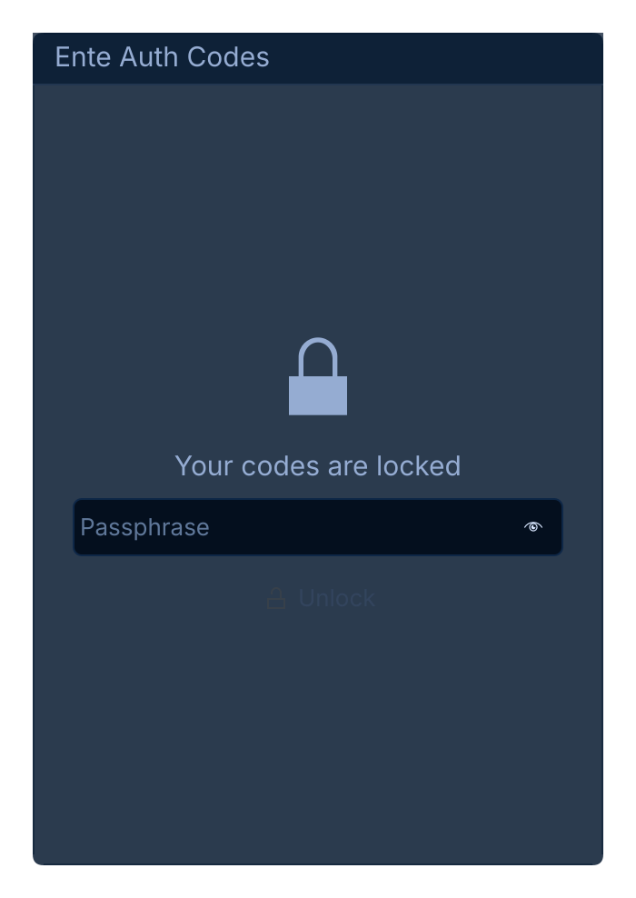

# KDE Plasma için Ente Auth Kodları

[](https://github.com/YakupEmreYerli/ente-auth-plasmoid/actions/workflows/ci.yml) [](LICENSE) [](https://kde.org/plasma-desktop/) [](core)

[Ente Auth](https://ente.io/auth/) iki aşamalı doğrulama kodlarınız Plasma panelinde: simgeye tıklayın, birkaç harf
yazın, Enter'a basın; kod panonuzda.

> English: [README.md](README.md)



- **Ara ve kopyala.** Yazdıkça süzülür, Enter ya da tıklama kodu kopyalar; yapıştırabilmeniz için pencere kapanır.
- **Hep eşit.** Telefonda kod ekleyin, burada da görünür: kilit açıkken bileşen resmî Ente CLI ile her 10 dakikada
  bir (ve eşitle düğmesine basınca) değişiklikleri çeker.
- **Servis logoları.** Ente Auth'un gösterdiği logolar, geri kalanlar için Simple Icons. İki set de bir kez, bütün
  olarak indirilir; hiçbir istek kullandığınız bir servisin adını taşımaz.
- **Siz açana kadar kilitli.** Kodlar diskte şifreli durur (scrypt + AES-256-GCM), parolanızı bileşene yazınca
  yalnızca küçük bir arka plan sürecinin belleğine çözülür. Parola komut satırından değil D-Bus üzerinden gider.
- **Pano temizliği.** Kopyalanan kod "hassas" işaretlenir (Klipper geçmişine yazmaz) ve hâlâ panodaysa 30 saniye
  sonra silinir.

## Kurulum

KDE Plasma 6, derlemek için Rust (`cargo`) ve `wl-clipboard` gerekir.

```sh
git clone https://github.com/YakupEmreYerli/ente-auth-plasmoid
cd ente-auth-plasmoid
./install.sh
```

`ente-codes` komutunu, arka plan servisini (`systemctl --user status ente-auth-plasmoid`) ve bileşeni kurar.
Kilidi bileşene parolanızı yazarak açarsınız; `--login-unlock` bunun yerine oturum açılışında bir kez sorar. Sonra panele sağ tıklayıp
*Bileşen Ekle…* ile **Ente Auth Kodları**'nı ekleyin.

## Kodları getirmek

Bileşeni açın: ilk seferde iki düğmeli kısa bir rehber gösterir. **Bağlan…** bir terminalde `ente-codes setup`
sihirbazını açar; Ente CLI girişini sizin yerinize yürütür (yalnız Ente e-postanızı, şifrenizi ve doğrulama
kodunuzu yazarsınız), kodları indirir ve bir parola sorar. **Dosya seç…** dışa aktarılmış bir dosyayı içe aktarır.

<p> </p>

Aynısını elle yapmak için bunları kendi terminalinizde çalıştırın. İlk seferde bir parola seçersiniz; bu, kodları bu bilgisayarda korur ve
Ente şifrenizden ayrıdır.

**Ente Auth uygulamasından** (en kolayı): *Ayarlar → Veri → Kodları dışa aktar → Düz metin*, dosyayı kaydedin,
sonra

```sh
ente-codes import ~/İndirilenler/ente-auth-codes.txt --delete-source
```

`--delete-source` düz metin dosyanın üzerine yazıp siler.

**Resmî [Ente CLI](https://github.com/ente-io/ente/tree/main/cli) ile** (önerilen: yeni kodlar kendiliğinden gelir):

```sh
ente account add                       # bir kez; "auth" uygulamasını seçin, dışa aktarma klasörü fark etmez
ente-codes ente-account siz@example.com
ente-codes sync                        # ilk sefer: parolanızı seçin
```

Bundan sonra arka plan süreci kilit açıkken kendiliğinden eşitler (`ente-codes settings --sync-minutes N`). Her
eşitlemede CLI'nin dışa aktarımı `$XDG_RUNTIME_DIR`'a (RAM) gider, okunur ve hemen silinir; diske hiç değmez.

## Komut

```text
ente-codes setup               ilk kurulum sihirbazı (Ente girişi, indirme, parola)
ente-codes status              kilitli, açık ya da boş
ente-codes unlock [--gui]      parolayı yaz
ente-codes lock                bir sonraki açılışa kadar kodları unut
ente-codes codes               güncel kodlar (yalnız terminal)
ente-codes copy github         bir kodu panoya kopyala
ente-codes list                hesap adları, kod yok
ente-codes passwd              parolayı değiştir
ente-codes sync                şimdi Ente ile eşitle
ente-codes icons [--force]     logo setlerini yeniden indir
ente-codes settings --clear-seconds 30 --lock-minutes 15 --sync-minutes 10
```

Makine okunur çıktı için `--json`. Çıkış kodları: 3 kilitli, 4 içe aktarım yok, 5 reddedildi.

Güvenlik ayrıntıları ve sınırları için [README.md](README.md#how-it-protects-your-codes) ve
[SECURITY.md](SECURITY.md).

## Emek

- Kodlarınızı asıl tutan [Ente Auth](https://github.com/ente-io/ente) ve CLI'sıdır; bu bileşen onları okur. Ente'nin
  simge seti (AGPL-3.0) depoda yer almaz, sizin önbelleğinize indirilir.
- Diğer logolar [Simple Icons](https://simpleicons.org)'tan (CC0). Marka adları ve logoları sahiplerinindir.

## Lisans

GPL-2.0-or-later. Ente ile bağlantılı değildir.
